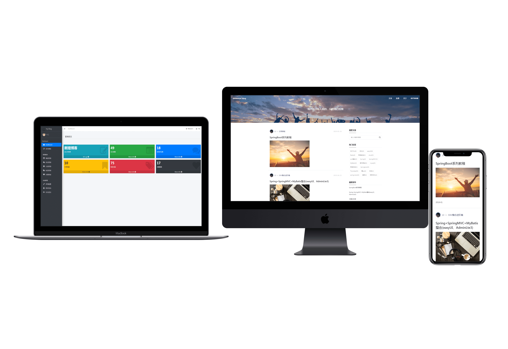
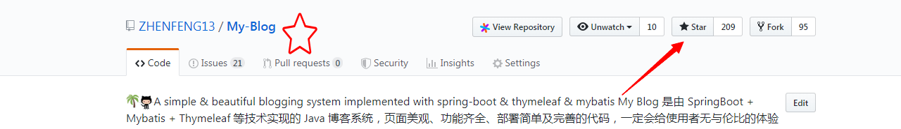

# My Blog



**坚持不易，各位朋友如果觉得项目还不错的话可以给项目一个 star 吧，也是对我一直更新代码的一种鼓励啦，谢谢各位的支持。**



- **你可以拿它作为博客模板，因为 My Blog 界面十分美观简洁，满足私人博客的一切要求；**
- **你也可以把它作为 SpringBoot 技术栈的学习项目，My Blog也足够符合要求，且代码和功能完备；**
- **内置三套博客主题模板，主题风格各有千秋，满足大家的选择空间，后续会继续增加，以供大家打造自己的博客；**
- **技术栈新颖且知识点丰富，学习后可以提升大家对于知识的理解和掌握，对于提升你的市场竞争力有一定的帮助。*


## 注意事项

- **数据库文件目录为```static-files/my_blog_db.sql```；**
- **部署后你可以根据自己需求修改版权文案、logo 图片、备案记录等网站基础信息；**
- **My Blog 后台管理系统的默认登陆账号为 admin 默认登陆密码为 admin
